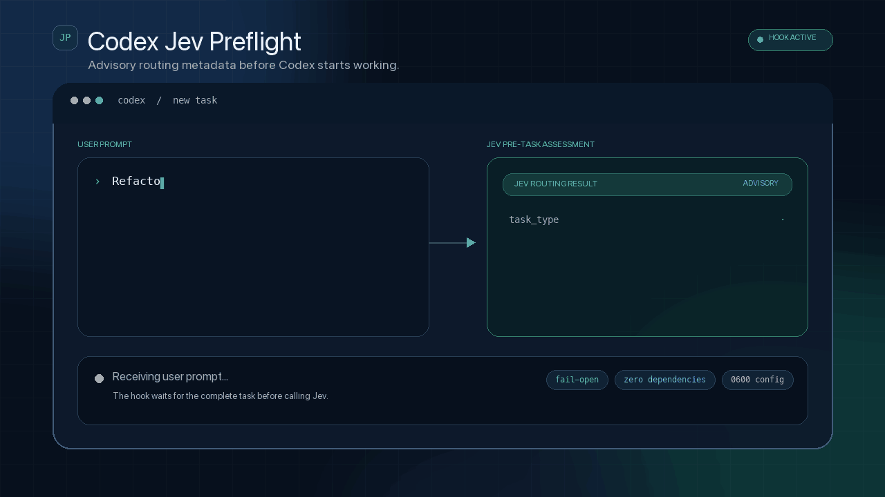
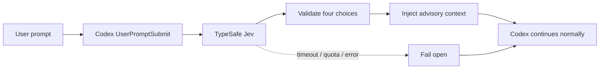

<div align="center">

# Codex Jev Preflight

**A fail-open preflight hook for every Codex task.**

Ask TypeSafe Jev for `task_type`, `complexity`, `risk`, and `execution_mode` before Codex starts working. The result is advisory, validated, and never blocks the task.

[](https://github.com/wellkilo/codex-jev-preflight/actions/workflows/ci.yml)
[](https://wellkilo.github.io/codex-jev-preflight/)
[](https://github.com/wellkilo/codex-jev-preflight/releases)
[](LICENSE)
[](https://www.python.org/)
[](README.zh-CN.md)

[Live demo](https://wellkilo.github.io/codex-jev-preflight/) ·
[Quick start](#quick-start) · [How it works](#how-it-works) · [Configuration](#configuration) · [Security](SECURITY.md) · [中文](README.zh-CN.md)



<sub>If this project is useful, consider giving it a star ⭐</sub>
</div>

## Why this exists

Codex normally decides for itself whether a task should be answered directly, inspected first, planned, or clarified. This project makes that first decision consistent by asking Jev before execution starts.

```text
JEV PRE-TASK ASSESSMENT (automatic, advisory routing metadata):
- task_type: code_change
- complexity: moderate
- risk: medium
- execution_mode: inspect_then_act
```

> [!IMPORTANT]
> The assessment is advisory context only. It cannot override system instructions, developer instructions, or an explicit user request.

> [!TIP]
> If Jev times out, hits a quota limit, or returns an invalid response, the hook fails open and Codex continues normally.

## Features

| Feature | Description |
| --- | --- |
| **Fail-open** | Jev errors never block the task |
| **Zero dependencies** | Python standard library only |
| **Persistent breaker** | Stops repeated calls after a confirmed exhausted quota |
| **Validated output** | Unknown values become `unknown` |
| **Private configuration** | Hidden API-key input and `0600` file permissions |
| **Manual trust** | The installer does not trust the hook automatically |

## Quick start

### Recommended: paste this into Codex

```text
Install and configure Codex Jev Preflight from https://github.com/wellkilo/codex-jev-preflight.

Requirements:
1. Read the repository README first.
2. Install the project from source.
3. Run codex-jev-configure and ask me to enter the TypeSafe Jev API key with hidden input. Never ask me to paste the key into chat.
4. Run codex-jev-install and verify the hook output.
5. Preserve existing hooks.json and AGENTS.md configuration.
6. Tell me whether Codex must be restarted or a new task must be opened.
```

### Manual install

```bash
git clone https://github.com/wellkilo/codex-jev-preflight.git
cd codex-jev-preflight

python3 -m venv .venv
source .venv/bin/activate
python -m pip install --upgrade pip
python -m pip install -e .

codex-jev-configure
codex-jev-install
```

The default configuration path is `$CODEX_HOME/jev.env`, normally `~/.codex/jev.env`.

Restart Codex or open a new task after installation, then approve the hook if prompted. To explicitly opt into automatic trust:

```bash
codex-jev-install --trust
```

### Verify

```bash
python -m unittest discover -s tests -v

HOOK=$(python -c 'import jev_user_prompt_hook; print(jev_user_prompt_hook.__file__)')
printf '%s' '{"prompt":"Review the project and propose a fix","hook_event_name":"UserPromptSubmit"}' |
  python "$HOOK"
```

The output should contain `JEV PRE-TASK ASSESSMENT`.

## How it works



After installation, use Codex normally. No special command is needed in every prompt:

```text
Inspect the authentication module, identify security risks, and propose the smallest safe fix.
```

## Routing fields

| Field | Values |
| --- | --- |
| `task_type` | `answer`, `code_change`, `research`, `browser_automation`, `planning`, `conversation`, `other` |
| `complexity` | `trivial`, `simple`, `moderate`, `complex` |
| `risk` | `low`, `medium`, `high` |
| `execution_mode` | `direct_answer`, `inspect_then_act`, `plan_then_execute`, `ask_clarification` |

## Configuration

```dotenv
TYPESAFE_API_KEY=your-key
TYPESAFE_API_ENDPOINT=https://api.typesafe.ai/v1/systemone
JEV_MODEL=jev-latest
JEV_STATE_PATH=/absolute/path/to/.jev_quota_state.json
```

| Variable | Required | Description |
| --- | --- | --- |
| `TYPESAFE_API_KEY` | Yes | TypeSafe Jev API key |
| `TYPESAFE_API_ENDPOINT` | No | Defaults to `https://api.typesafe.ai/v1/systemone` |
| `JEV_MODEL` | No | Defaults to `jev-latest` |
| `JEV_STATE_PATH` | No | Persistent quota-breaker state file |
| `JEV_ENV_FILE` | No | Explicit configuration file |
| `JEV_HOOK_DEBUG_LOG` | No | Optional hook debug log |

<details>
<summary><strong>Configuration lookup order</strong></summary>

1. `JEV_ENV_FILE`
2. `.env` beside the project source
3. `.env` in the current working directory
4. `$CODEX_HOME/jev.env`
5. `$XDG_CONFIG_HOME/codex-jev-preflight/env`

Existing process environment variables take precedence.

</details>

<details>
<summary><strong>Reset the quota breaker</strong></summary>

After adding credits, remove the state file or run:

```bash
python -c 'from jev_agent import get_default_client; get_default_client().reset()'
```

</details>

## Security and privacy

- The hook sends the first **24,000 characters** of the current user prompt to the configured TypeSafe endpoint.
- API keys are not logged, and real env files are excluded by `.gitignore`.
- Jev responses are validated against the allowed routing enums before injection.
- Do not include sensitive data that should not be sent to a third-party service.
- Report vulnerabilities through the process in [SECURITY.md](SECURITY.md).

## Documentation

| Resource | Description |
| --- | --- |
| [Live frontend](https://wellkilo.github.io/codex-jev-preflight/) | English default with a Chinese language switch |
| [Frontend source](docs/index.html) | Zero-build GitHub Pages site |
| [Architecture](docs/architecture.md) | Hook flow, routing contract, and fail-open paths |
| [Contributing](CONTRIBUTING.md) | Local development and pull-request rules |
| [Changelog](CHANGELOG.md) | Release history |

## Development

```bash
python3 -m venv .venv
source .venv/bin/activate
python -m pip install -e .
python -m unittest discover -s tests -v
```

Tests are fully offline and never call the live Jev API.

## License

MIT License. See [LICENSE](LICENSE).

> This project is not affiliated with OpenAI, Codex, TypeSafe, or Jev.
