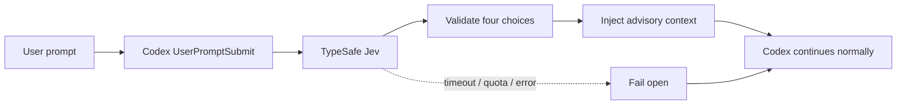

<div align="center">

# Codex Jev Preflight

**让 Codex 在每个任务动工前，先向 TypeSafe Jev 做一次预判。**

自动注入 `task_type`、`complexity`、`risk` 和 `execution_mode`，让任务路由更一致、风险更早暴露，同时保持 fail-open，绝不阻塞 Codex。

[](https://github.com/wellkilo/codex-jev-preflight/actions/workflows/ci.yml)
[](https://wellkilo.github.io/codex-jev-preflight/)
[](https://github.com/wellkilo/codex-jev-preflight/releases)
[](LICENSE)
[](https://www.python.org/)
[](https://github.com/wellkilo/codex-jev-preflight)

[在线演示](https://wellkilo.github.io/codex-jev-preflight/) ·
[快速开始](#快速开始) ·
[工作原理](#工作原理) ·
[配置](#配置) ·
[安全说明](SECURITY.md) ·
[English](README.en.md)

</div>

## 是什么

这是一个 Codex `UserPromptSubmit` Hook。每个新用户提示提交后、Codex 开始执行前，Hook 会调用一次 TypeSafe Jev，并为当前任务注入：

```text
JEV PRE-TASK ASSESSMENT (automatic, advisory routing metadata):
- task_type: code_change
- complexity: moderate
- risk: medium
- execution_mode: inspect_then_act
```

> [!IMPORTANT]
> 判断结果只是建议性上下文，不会替代 Codex，也不会覆盖系统指令、开发者指令或用户的明确要求。

> [!TIP]
> Jev 超时、限流、额度耗尽或响应异常时，Hook 会自动跳过，原任务继续执行。

## 特性

| 特性 | 说明 |
| --- | --- |
| **Fail-open** | Jev 不可用时不会阻塞 Codex |
| **零依赖** | 只使用 Python 标准库 |
| **持久熔断** | 额度耗尽后跨进程停止重复调用 |
| **枚举校验** | 未知返回值安全归一化为 `unknown` |
| **安全配置** | API Key 隐藏输入，配置权限为 `0600` |
| **可手动信任** | 安装器默认不自动信任 Hook |

## 快速开始

### 推荐方式：把 Prompt 发给 Codex

```text
请安装并配置 Codex Jev Preflight。

要求：
1. 阅读 https://github.com/wellkilo/codex-jev-preflight 的 README。
2. 从源码安装项目，并运行 codex-jev-configure 配置 TypeSafe Jev API Key。
3. API Key 必须隐藏输入，不要要求我在聊天中粘贴。
4. 运行 codex-jev-install 安装全局 UserPromptSubmit Hook。
5. 验证 Hook 输出，并告诉我需要重启 Codex 还是新建任务。
6. 不要覆盖 ~/.codex/hooks.json 或 ~/.codex/AGENTS.md 中的其他配置。
```

### 手动安装

```bash
git clone https://github.com/wellkilo/codex-jev-preflight.git
cd codex-jev-preflight

python3 -m venv .venv
source .venv/bin/activate
python -m pip install --upgrade pip
python -m pip install -e .
```

配置 API Key：

```bash
codex-jev-configure
```

默认写入 `$CODEX_HOME/jev.env`，通常是 `~/.codex/jev.env`。

安装并信任 Hook：

```bash
codex-jev-install
# 重启 Codex 或新建任务，然后按界面提示信任一次。
```

如果你明确接受自动信任行为：

```bash
codex-jev-install --trust
```

### 验证

```bash
python -m unittest discover -s tests -v

HOOK=$(python -c 'import jev_user_prompt_hook; print(jev_user_prompt_hook.__file__)')
printf '%s' '{"prompt":"检查项目并给出修复方案","hook_event_name":"UserPromptSubmit"}' |
  python "$HOOK"
```

成功时输出中应包含 `JEV PRE-TASK ASSESSMENT`。

## 安装后怎么用

正常向 Codex 提交任务即可，不需要在每条消息中手动调用 Jev：

```text
检查认证模块，定位安全风险并给出最小修复方案。
```

```text
阅读项目并实现导出 CSV 的功能，补充测试和 README。
```

```text
对比三个开源方案，给出架构、成本和维护风险建议。
```

## 工作原理



## 路由维度

| 字段 | 可选值 |
| --- | --- |
| `task_type` | `answer`, `code_change`, `research`, `browser_automation`, `planning`, `conversation`, `other` |
| `complexity` | `trivial`, `simple`, `moderate`, `complex` |
| `risk` | `low`, `medium`, `high` |
| `execution_mode` | `direct_answer`, `inspect_then_act`, `plan_then_execute`, `ask_clarification` |

## 配置

```dotenv
TYPESAFE_API_KEY=your-key
TYPESAFE_API_ENDPOINT=https://api.typesafe.ai/v1/systemone
JEV_MODEL=jev-latest
JEV_STATE_PATH=/absolute/path/to/.jev_quota_state.json
```

| 变量 | 必需 | 说明 |
| --- | --- | --- |
| `TYPESAFE_API_KEY` | 是 | TypeSafe Jev API Key |
| `TYPESAFE_API_ENDPOINT` | 否 | 默认 `https://api.typesafe.ai/v1/systemone` |
| `JEV_MODEL` | 否 | 默认 `jev-latest` |
| `JEV_STATE_PATH` | 否 | 持久化额度熔断状态 |
| `JEV_ENV_FILE` | 否 | 显式指定配置文件 |
| `JEV_HOOK_DEBUG_LOG` | 否 | 可选 Hook 调试日志 |

<details>
<summary><strong>配置查找顺序</strong></summary>

1. `JEV_ENV_FILE`
2. 项目源码目录中的 `.env`
3. 当前工作目录中的 `.env`
4. `$CODEX_HOME/jev.env`
5. `$XDG_CONFIG_HOME/codex-jev-preflight/env`

已存在的进程环境变量优先。

</details>

<details>
<summary><strong>额度熔断恢复</strong></summary>

增加额度后，删除状态文件或运行：

```bash
python -c 'from jev_agent import get_default_client; get_default_client().reset()'
```

</details>

## 安全与隐私

- Hook 会将当前用户提示的**前 24,000 个字符**发送到配置的 TypeSafe 端点。
- API Key 不会写入日志；真实配置文件已由 `.gitignore` 排除。
- Jev 返回值必须符合允许枚举，避免未校验内容注入 Codex 上下文。
- 请不要在提示中提交不希望发送到第三方服务的敏感信息。
- 漏洞报告方式见 [SECURITY.md](SECURITY.md)。

## 文档

| 文档 | 内容 |
| --- | --- |
| [在线展示前端](https://wellkilo.github.io/codex-jev-preflight/) | 快速开始、交互式演示和项目概览 |
| [前端源码](docs/index.html) | 零构建的 GitHub Pages 页面 |
| [架构说明](docs/architecture.md) | Hook 流程、路由协议和降级路径 |
| [贡献指南](CONTRIBUTING.md) | 本地开发和提交要求 |
| [更新日志](CHANGELOG.md) | 版本历史 |

## 开发

```bash
python3 -m venv .venv
source .venv/bin/activate
python -m pip install -e .
python -m unittest discover -s tests -v
```

测试完全离线，不会调用真实 Jev API。

## License

MIT License。见 [LICENSE](LICENSE)。

> 本项目不是 OpenAI、Codex、TypeSafe 或 Jev 的官方项目。
