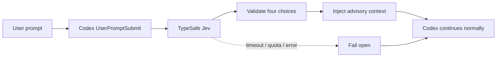

<div align="center">

# Codex Jev Preflight

**为每个 Codex 任务增加一次自动预判。**

在 Codex 开始执行前，通过 TypeSafe Jev 获取 `task_type`、`complexity`、`risk` 和 `execution_mode`。判定仅作为建议上下文，并且始终 fail-open，不会阻塞任务。

[](https://github.com/wellkilo/codex-jev-preflight/actions/workflows/ci.yml)
[](https://wellkilo.github.io/codex-jev-preflight/?lang=zh)
[](https://github.com/wellkilo/codex-jev-preflight/releases)
[](LICENSE)

[在线演示](https://wellkilo.github.io/codex-jev-preflight/?lang=zh) ·
[快速开始](#快速开始) · [工作原理](#工作原理) · [配置](#配置) · [English](README.md)


<sub>如果这个项目对你有帮助，欢迎点一个 Star ⭐</sub>
</div>

## 为什么需要它

Codex 通常自行判断任务应该直接回答、先检查、先规划，还是先澄清。本项目把这第一步统一交给 Jev，在模型开始工作前提供稳定的结构化提示。

> [!IMPORTANT]
> 判定结果只是建议性上下文，不会覆盖系统指令、开发者指令或用户的明确要求。

> [!TIP]
> Jev 超时、限流、额度耗尽或响应异常时，Hook 会自动跳过，Codex 继续正常工作。

## 快速开始

把下面这段 Prompt 粘贴给 Codex：

```text
请安装并配置 Codex Jev Preflight。

要求：
1. 阅读 https://github.com/wellkilo/codex-jev-preflight 的 README。
2. 从源码安装项目。
3. 运行 codex-jev-configure，API Key 必须隐藏输入，不要要求我在聊天中粘贴。
4. 运行 codex-jev-install 并验证 Hook 输出。
5. 不要覆盖现有的 hooks.json 和 AGENTS.md 配置。
6. 告诉我需要重启 Codex 还是新建任务。
```

手动安装：

```bash
git clone https://github.com/wellkilo/codex-jev-preflight.git
cd codex-jev-preflight

python3 -m venv .venv
source .venv/bin/activate
python -m pip install --upgrade pip
python -m pip install -e .

codex-jev-configure
codex-jev-install
```

安装器默认不会自动信任 Hook。安装后重启 Codex 或新建任务，并按界面提示确认。如需显式开启自动信任：

```bash
codex-jev-install --trust
```

### 验证

```bash
python -m unittest discover -s tests -v

HOOK=$(python -c 'import jev_user_prompt_hook; print(jev_user_prompt_hook.__file__)')
printf '%s' '{"prompt":"检查项目并给出修复方案","hook_event_name":"UserPromptSubmit"}' |
  python "$HOOK"
```

成功时输出应包含 `JEV PRE-TASK ASSESSMENT`。

## 工作原理



安装后正常提交 Codex 任务即可，不需要在每条消息中手动调用 Jev。

## 路由维度

| 字段 | 可选值 |
| --- | --- |
| `task_type` | `answer`, `code_change`, `research`, `browser_automation`, `planning`, `conversation`, `other` |
| `complexity` | `trivial`, `simple`, `moderate`, `complex` |
| `risk` | `low`, `medium`, `high` |
| `execution_mode` | `direct_answer`, `inspect_then_act`, `plan_then_execute`, `ask_clarification` |

## 配置

```dotenv
TYPESAFE_API_KEY=your-key
TYPESAFE_API_ENDPOINT=https://api.typesafe.ai/v1/systemone
JEV_MODEL=jev-latest
JEV_STATE_PATH=/absolute/path/to/.jev_quota_state.json
```

默认配置文件为 `$CODEX_HOME/jev.env`，通常是 `~/.codex/jev.env`。

## 安全与隐私

- Hook 会将当前用户提示的前 **24,000 个字符**发送到配置的 TypeSafe 端点。
- API Key 不会写入日志，真实配置文件已由 `.gitignore` 排除。
- Jev 返回值必须符合允许枚举，避免未校验内容注入 Codex 上下文。
- 漏洞报告方式见 [SECURITY.md](SECURITY.md)。

## 文档

| 文档 | 内容 |
| --- | --- |
| [在线展示前端](https://wellkilo.github.io/codex-jev-preflight/?lang=zh) | 默认英文并支持中文切换 |
| [架构说明](docs/architecture.md) | Hook 流程和降级路径 |
| [贡献指南](CONTRIBUTING.md) | 本地开发和提交要求 |

## License

MIT License。见 [LICENSE](LICENSE)。

> 本项目不是 OpenAI、Codex、TypeSafe 或 Jev 的官方项目。
